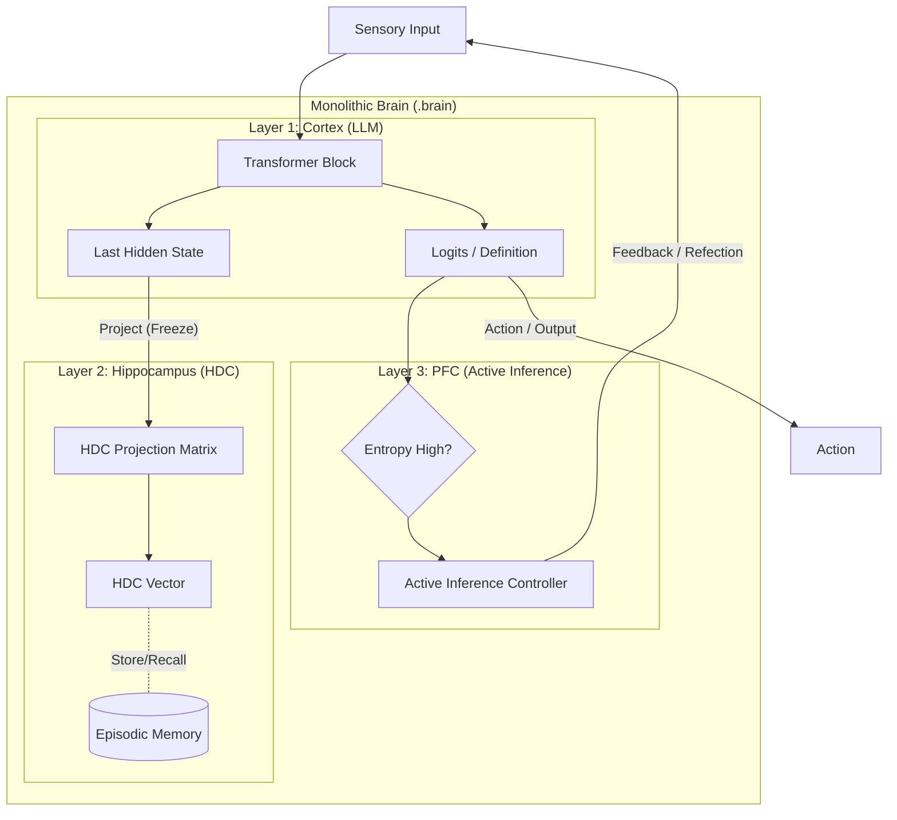

# System Architecture

## Overview

Monolithic Brainは、**Neural-Symbolic** なアプローチを採用しています。ニューラルネットワークの柔軟性と、HDC（Hyperdimensional Computing）の堅牢なシンボル操作性、そして能動的推論による自律性を兼ね備えています。

## Components

## Components

### 1. Cortex (Startum 1: Reasoning)
*   **Base Model**: `Qwen/Qwen2.5-1.5B-Instruct` (GGUF Format)
*   **Mechanism**: **Dual-Llama Architecture**
    *   `llm_gen` (Left Hemisphere): テキスト生成に特化 (`logits_all=False`, `embedding=False`).
    *   `llm_embed` (Right Hemisphere): ベクトル抽出に特化 (`embedding=True`).
    *   ※ `llama-cpp-python` の仕様制約（生成と埋め込みの同居不可）を回避するための設計優位性として、言語処理と意味理解を並列化しています。
*   **Role**: パターン認識、次トークン予測、文脈理解。

### 2. Hippocampus (Startum 2: Memory & Grounding)
*   **Mechanism**: Random Projection (Gaussian) + **Superposition Memory**.
*   **Role**:
    *   **Grounding**: LLMの埋め込みベクトル (Dim:1536) を、高次元 (Dim:4096) の概念空間に射影。
    *   **Episodic Memory**: 生成された思考ベクトルを「重ね合わせ（Superposition）」で保存。
    *   **Recall**: 現在の思考と記憶トレースのコサイン類似度で想起判定。
*   **Math**: 
    1. $h_{pooled} = \text{MeanPool}(E_{LLM})$
    2. $v_{HDC} = \text{sign}(h_{pooled} \cdot W_{proj})$
    3. $M_{new} = (1-\alpha)M_{old} + v_{HDC}$ (Decay & Add)

### 3. Prefrontal Cortex (Startum 3: Metacognition)
*   **Mechanism**: Entropy-based Control (Simplified).
*   **Role**: エージェントの「状態」を管理します。現状は `logprobs` が使用できないため、プレースホルダーとして機能しています（将来的には生成確率の分散を利用予定）。
*   **Parameters**: `curiosity_threshold`, `energy_budget`

## Data Flow

1.  **Perception**: テキスト入力が `Cortex` に送られる。
2.  **Processing**: `Cortex` が隠れ状態とロジットを計算する。
3.  **Abstraction**: 最終隠れ状態が `Hippocampus` に送られ、HDCベクトル（現在の「思考の形」）に変換される。
4.  **Meta-Cognition**: ロジットのエントロピーが計算され、`PFC` が「反射的行動」か「熟慮」かを判定する。
5.  **Action/Loop**: 判定結果に基づき、外部出力を行うか、内部思考ループ（Contextへの追記）を行う。
